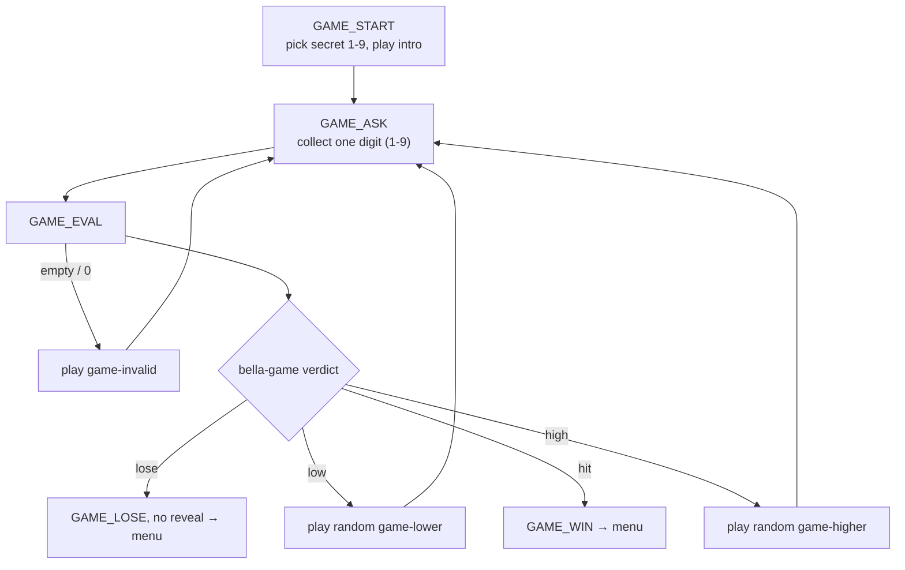

# Guess My Number — Bella's hidden game (menu option `5`)

A quick keypad guessing game Bella plays with the caller from her lounge. She
thinks of a number **1–9**; the caller dials one guess at a time and she teases
*higher* or *lower* until they find it — or run out of tries. She never says the
number out loud, so it needs no text-to-speech: only a fixed set of feedback
prompts.

## Overview

- **Premise:** Bella picks a secret number 1–9. Each guess is a single keypress.
  She replies *higher* / *lower* (from a few random variants) until the caller
  hits it (**win**) or uses up their tries (**lose**).
- **Persona:** the 1920s matriarch — teasing, warm, and never gives the secret
  away, even on a loss ("a lady keeps a few secrets").
- **Tries:** default **3**, tunable via the `game_tries_max` var in
  [conf/vars.xml](conf/vars.xml).
- **Voice:** same bracketed emotional-cue style as [PROMPTS.md](PROMPTS.md); this
  file is the source of truth for generating the prompt audio.

## How to reach it

It is a **secret**: at the main menu the caller dials **`5`**. Bella never
announces it. Internally, menu option `5` routes to `GAME_START` (see
[conf/dialplan/default/70_option5_game.xml](conf/dialplan/default/70_option5_game.xml) and the
`dispatch-game` entry in
[conf/dialplan/default/10_inbound_and_menu.xml](conf/dialplan/default/10_inbound_and_menu.xml)).

## Flow

Every `GAME_ASK` resets `max_forwards` (a long game chains many transfers, which
would otherwise exhaust the per-call budget and drop the call).

## Prompts

| Prompt | When it plays |
|---|---|
| `game-intro.wav` | Once, at the start — the rules. |
| `game-higher-1..3.wav` | Random, when the secret is **higher** than the guess. |
| `game-lower-1..3.wav` | Random, when the secret is **lower** than the guess. |
| `game-win.wav` | Correct guess. |
| `game-lose.wav` | Out of tries (the number is **not** revealed). |
| `game-invalid.wav` | No digit / a `0` / anything outside 1–9. |

## Helper: `scripts/bella-game`

Stateless bash helper (mirrors [scripts/bella-messages](scripts/bella-messages));
all output is newline-free for `${system(...)}`.

| Command | Prints |
|---|---|
| `secret <min> <max>` | a random integer in `[min,max]` |
| `verdict <min> <max> <secret> <guess> <tries> <maxtries>` | `bad` \| `hit` \| `high` \| `low` \| `lose` |
| `incr <n>` | `n+1` (missing/invalid → `1`) |
| `hint high\|low` | absolute path of a random `game-higher/lower-N.wav` |

`verdict` consumes a try only for a valid in-range guess: it computes
`newtries = tries + 1`, then returns `hit` if the guess matches, `lose` if
`newtries` reaches `maxtries`, otherwise `high`/`low`.