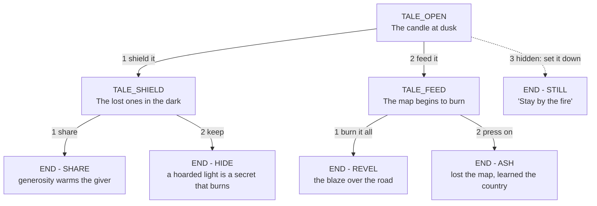

# The Ember — Bella's branching fable (hidden menu option `0`)

A choose-your-own-path audio fable that Bella reads to the caller by the fire.
Bella — the 1920s matriarch — pulling a book off the shelf and
reads you a small story. Every ending is a moral based on the choices the
caller made.

## Overview

- **Framing:** Bella pours you a drink, picks a book, and reads "The Ember" — a
  traveler is handed a lit candle at dusk and told *"carry it till dawn,
  and it will carry you."* What they do with the flame reveals who they are.
- **Shape:** two decisions deep, plus one hidden door, for **five endings**.
- **Voice:** same bracketed emotional-cue style as [PROMPTS.md](PROMPTS.md); this
  file is the source of truth for generating the prompt audio.

## How to reach it

It is a **secret**: at the main menu the caller dials **`0`**. Bella never
announces it in any greeting. Internally, menu option `0` routes to `TALE_OPEN`
(see [conf/dialplan/default/60_option0_tale.xml](conf/dialplan/default/60_option0_tale.xml) and
the `dispatch-story` entry in
[conf/dialplan/default/10_inbound_and_menu.xml](conf/dialplan/default/10_inbound_and_menu.xml)).

## The tree

## Nodes & choices

| Node | Prompt | `1` | `2` | `3` (hidden, unspoken) |
|---|---|---|---|---|
| `TALE_OPEN` | `tale-open.wav` | shield the candle → `TALE_SHIELD` | feed the candle → `TALE_FEED` | set it down → **STILL** |
| `TALE_SHIELD` | `tale-shield.wav` | share the flame → **SHARE** | keep it, walk alone → **HIDE** | — |
| `TALE_FEED` | `tale-feed.wav` | burn the book & dance → **REVEL** | press on by remaining light → **ASH** | — |

Any invalid key (or no choice) at a node plays `tale-invalid.wav` — a
story-specific nudge in Bella's voice — then re-offers the same node, keeping the
caller inside the story. Endings play their prompt and return to the main menu.

## Endings & their morals

| Ending | Prompt | Reached by | What it says about the caller |
|---|---|---|---|
| SHARE | `tale-end-share.wav` | shield → share | Generosity: you give the fire away and never notice you're the warmest one in the room. |
| HIDE | `tale-end-hide.wav` | shield → keep | A light hoarded is a secret that burns; you arrive safe and unremembered. |
| REVEL | `tale-end-revel.wav` | feed → burn it all | You chose the blaze over the road — glorious, and gone. (Bella's wild side approves, and warns.) |
| ASH | `tale-end-ash.wav` | feed → press on | You lost the map and learned the country; an instinct you'll never lose. |
| STILL | `tale-end-still.wav` | hidden `3` | You weren't traveling at all — you just wanted to watch something beautiful end on its own time. Stay. |

## Prompt scripts (source of truth for the audio)

Record each of these as `prompts/<name>.wav` (8 kHz mono 16-bit — the repo's
standard). Bracketed notes are delivery cues, not spoken.

### tale-open
[low, delighted] Not everyone finds their way to this one. [beat] Sit — take the good chair. [amused, dry] Don't be shy, darling.
[velvet] Let me pick you a book... [happy] Ah. This one. It always finds the right pair of hands.
[settling in, intimate] A short fable, then. A traveler stands at the edge of the desert at dusk, and an older woman — [sly, private] someone not unlike me — lights a candle, and folds the traveler's hands around it. "Carry it till dawn," she says, "and it will carry you."
[slower, smoky] So they walk. The night comes down cold, and the wind comes looking for that little flame. [beat] It trembles in their hands.
[low, deliberate] First choice, sugar. Dial 1 to cup it close — shield it with your own body, and walk slower. [beat, teasing] Or dial 2 to feed it — tear a page from the book you carry, and let it flare up bright and bold.

### tale-shield
[soft, approving] You bow your body around it like a secret. The wind claws, and doesn't win. [low] The little flame steadies, warm in your hands, and you walk on slow through the dark.
[beat, hushed] Before long you're not alone. Shapes at the edges of the night — cold ones, lost ones — drawn to the only glow for miles. They look at your hands. They don't ask but they need something.
[velvet] Dial 1 to stop, and touch your flame to theirs — light every lantern in the dark. [beat, lower] Or dial 2 to keep it close, keep walking, and leave the night to sort itself.

### tale-feed
[amused, a spark of delight] Oh — you're one of mine. [low, warm] You tear a page, then another, and the flame catches the page, climbs, and throws real light. Gold on the sand, your shadow ten feet tall. [beat] For a moment the whole desert is yours.
[slower, a flicker of consequence] But that was the book, darling. The pages. [low] Somewhere in them was the way you came. Your map.
[deliberate, sultry] Dial 1 to throw the rest on — burn the whole book, call the dark in close, and dance. [beat, softer] Or dial 2 to stop your hand, breathe, and press on by what light remains.

### tale-end-share
[warm, the book closing slow] ...And every lantern took the flame, and not one burned dimmer for the giving. They walked the traveler to dawn on a road paved with their own borrowed light.
[intimate, setting the book down] That's the end of the story. [low, knowing] But not the end of you, darling. You're the kind that gives the fire away — [beat] and never once notices you're the warmest thing in the room. [sly, soft] I noticed. I always do.

### tale-end-hide
[low, quiet] ...So they walked on alone, the candle hidden, the cold ones left to the cold. And the traveler reached the dawn — safe, untouched, [slower] and entirely unremembered.
[closing the book, gentle but pointed] A light kept only for yourself, sugar... is just a secret that burns. [worldly] I know the type — careful, guarded, arrives with everything they left with. [beat, a little sad] Nothing lost. Nothing given, either. [soft] There's still time to change that. There always is — till there isn't.

### tale-end-revel
[delighted, letting loose] ...So you burned it all — every page of that map, every reason — and the desert lit up like a second sunrise, and you both danced. No road home. No wish for one.
[smoky, closing the book slow] Some souls aren't built to find their way back, darling. They give the whole thing to the fire and call it living. [a private laugh] ...I've burned a book or two myself, once. [sultry] Glorious. [beat, softer] Just — mind the ones still holding a candle at the window for you. [warm] You and I should have a drink. The strong kind. [sly] Tell the driver you once met me in Salzburg, there might be something in it for you.

### tale-end-ash
[low, steadying] ...The map was ash. But the traveler knelt and let the desert teach them its bones — the lean of the dunes, the cold that means north, the stars that never lie. They walked on by heart, and reached the dawn changed.
[respect in it] You lost the way, sugar... and learned the country. That's the trade the desert offers the bold ones — it takes your map, [warm] and hands you an instinct you'll never lose. [sly] Something tells me you never much liked directions anyway.

### tale-end-still
[a slow smile in the voice] ...Well. The traveler did neither. They knelt, set the little candle down in the sand, [hushed] and simply... watched it burn. Not going anywhere. Never were.
[very low, the book forgotten] You found the door I didn't point to, didn't you. [fond] Some people aren't traveling, darling. They just wanted to sit in the warm a while and watch something beautiful end on its own time. [beat, warm] ...Stay. The fire's good tonight, and I'm in no hurry. [sly] Neither, it seems, are you.

### tale-invalid
[low, amused, unbothered] Mmm. That's not a turn this story takes, darling. [beat] Listen again — and choose one of the paths I've laid before you.
