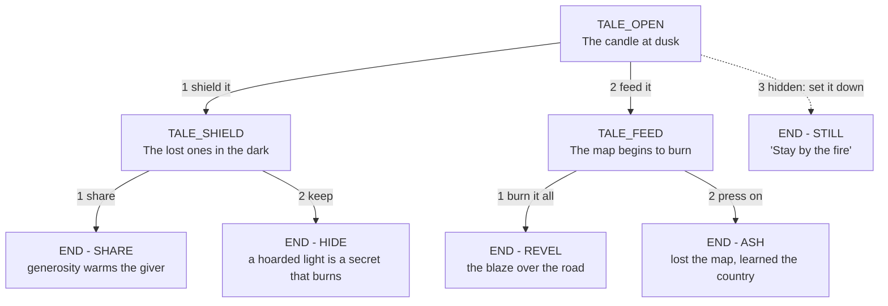

# The Ember — Bella's branching fable (hidden menu option `0`)

A choose-your-own-path audio fable that Bella reads to the caller by the fire.
Bella — the 1920s matriarch — pulling a book off the shelf and
reads you a small story. Every ending is a moral based on the choices the
caller made.

## Overview

- **Framing:** Bella pours you a drink, picks a book, and reads "The Ember" — a
  traveler is handed a lit candle at dusk and told *"carry it till dawn,
  and it will carry you."* What they do with the flame reveals who they are.
- **Shape:** two decisions deep, plus one hidden door, for **five endings**.
- **Voice:** same bracketed emotional-cue style as [PROMPTS.md](PROMPTS.md); this
  file is the source of truth for generating the prompt audio.

## How to reach it

It is a **secret**: at the main menu the caller dials **`9`**. Bella never
announces it in any greeting. Internally, menu option `9` routes to `TALE_OPEN`
(see [conf/dialplan/default/60_option9_tale.xml](conf/dialplan/default/60_option9_tale.xml) and
the `dispatch-story` entry in
[conf/dialplan/default/10_inbound_and_menu.xml](conf/dialplan/default/10_inbound_and_menu.xml)).

## The tree

## Nodes & choices

| Node | Prompt | `1` | `2` | `3` (hidden, unspoken) |
|---|---|---|---|---|
| `TALE_OPEN` | `tale-open.wav` | shield the candle → `TALE_SHIELD` | feed the candle → `TALE_FEED` | set it down → **STILL** |
| `TALE_SHIELD` | `tale-shield.wav` | share the flame → **SHARE** | keep it, walk alone → **HIDE** | — |
| `TALE_FEED` | `tale-feed.wav` | burn the book & dance → **REVEL** | press on by remaining light → **ASH** | — |

Any invalid key (or no choice) at a node plays `tale-invalid.wav` — a
story-specific nudge in Bella's voice — then re-offers the same node, keeping the
caller inside the story. Endings play their prompt and return to the main menu.

## Endings & their morals

| Ending | Prompt | Reached by | What it says about the caller |
|---|---|---|---|
| SHARE | `tale-end-share.wav` | shield → share | Generosity: you give the fire away and never notice you're the warmest one in the room. |
| HIDE | `tale-end-hide.wav` | shield → keep | A light hoarded is a secret that burns; you arrive safe and unremembered. |
| REVEL | `tale-end-revel.wav` | feed → burn it all | You chose the blaze over the road — glorious, and gone. (Bella's wild side approves, and warns.) |
| ASH | `tale-end-ash.wav` | feed → press on | You lost the map and learned the country; an instinct you'll never lose. |
| STILL | `tale-end-still.wav` | hidden `3` | You weren't traveling at all — you just wanted to watch something beautiful end on its own time. Stay. |