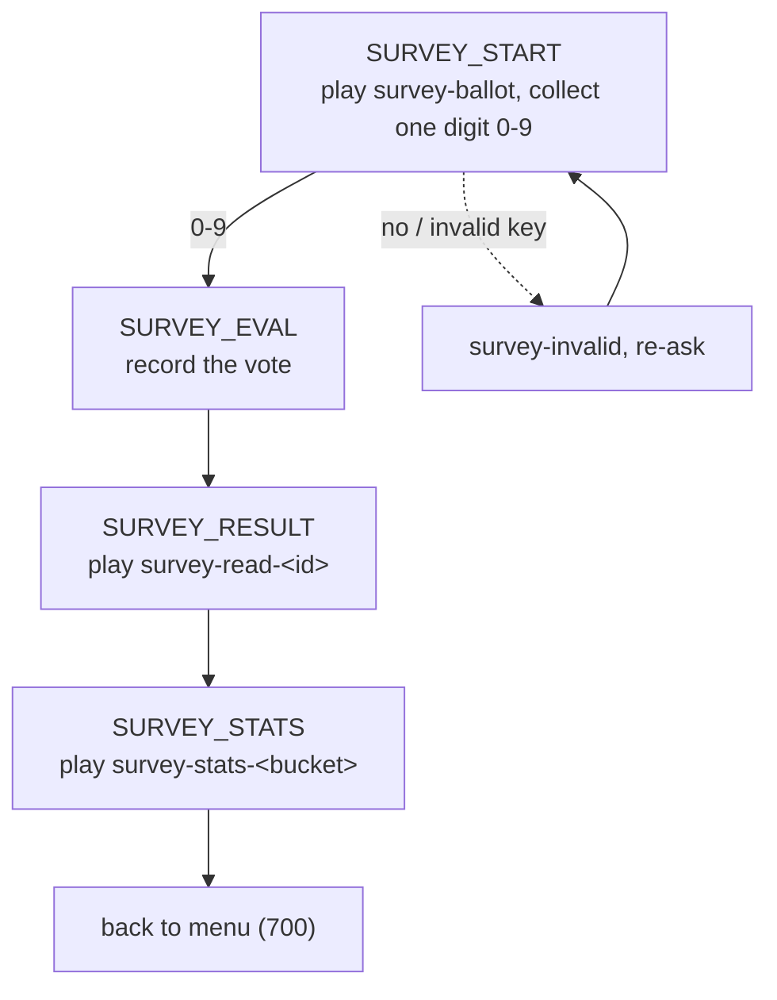

# Which Are You? — Bella's principles survey (hidden menu option `9`)

A one-question, ten-answer survey Bella offers by the fire. She asks *"which
best describes you right now?"*, the caller votes with a single keypress, and
Bella plays a short reading for the outlook they chose — then tells them where
that pick stands with everyone who has called before.

Each of the ten answers is one of the ten guiding ideas the whole gathering is
built on, voiced entirely as Bella's own way of living — a thin veil that quietly
reinforces the idea as the real reason the caller is here. She never names the
event or the place and never lectures — but the moment you choose, she names the
idea itself, like turning over a card, as a small reward for playing along.

## Overview

- **Framing:** Bella runs a playful "little survey, just between us." One ballot
  lists ten vibes on keys `1`–`9` and `0`; the caller presses one.
- **Payload:** the chosen key plays a `survey-read-*` reading (Bella embodying
  that idea), then a `survey-stats-*` line placing the pick among all callers.
- **Tally:** anonymous and persistent. Only ten counters are kept (one per key);
  no caller data is ever stored.
- **Voice:** same bracketed emotional-cue style as [PROMPTS.md](PROMPTS.md),
  which holds the canonical prompt text.

## How to reach it

It is a **secret**: at the main menu the caller dials **`9`**. Bella never
announces it in any greeting. Internally, menu option `9` routes to
`SURVEY_START` (see
[conf/dialplan/default/80_option9_survey.xml](conf/dialplan/default/80_option9_survey.xml)
and the `dispatch-survey` entry in
[conf/dialplan/default/10_inbound_and_menu.xml](conf/dialplan/default/10_inbound_and_menu.xml)).

## The ballot

| Key | The vibe on the ballot | The idea it embodies | Reading |
|---|---|---|---|
| `1` | Open your door to any stranger | Radical inclusion | `survey-read-1` |
| `2` | Sooner give than take | Gifting | `survey-read-2` |
| `3` | Can't be bought | Decommodification | `survey-read-3` |
| `4` | Carry everything you need inside | Radical self-reliance | `survey-read-4` |
| `5` | Born to be looked at | Radical self-expression | `survey-read-5` |
| `6` | Nothing without your people | Communal effort | `survey-read-6` |
| `7` | Look after everyone in the room | Civic responsibility | `survey-read-7` |
| `8` | Leave a place better than you found it | Leaving no trace | `survey-read-8` |
| `9` | Sooner do than watch | Participation | `survey-read-9` |
| `0` | All that's real is right now | Immediacy | `survey-read-0` |

## The flow

The vote is recorded **before** the standing is read, so the caller is counted
and a brand-new pick reads as `first`.

## The standing buckets

`bella-survey stats <id>` returns exactly one keyword; the dialplan plays the
matching `survey-stats-*` prompt. The pick's own vote is already counted.

| Bucket | Meaning | Prompt |
|---|---|---|
| `first`  | this pick just received its very first vote | `survey-stats-first` |
| `top`    | a most-chosen option | `survey-stats-top` |
| `high`   | at or above the average | `survey-stats-high` |
| `low`    | below the average | `survey-stats-low` |
| `rarest` | a least-chosen option | `survey-stats-rarest` |

`first` takes precedence; then `top`/`rarest` (only when some options actually
differ); otherwise `high` (at/above the mean) or `low` (below it). The catch-all
in the dialplan falls back to `high` if the helper is ever unavailable.

## The `bella-survey` helper

[`scripts/bella-survey`](scripts/bella-survey) is a small bash helper (same
pattern as [`scripts/bella-game`](scripts/bella-game)). It runs as the freeswitch
user (no sudo) and prints newline-free output for use directly in the dialplan
via `${system(...)}`.

| Command | Prints | Notes |
|---|---|---|
| `vote <id>` | new total votes across all options | atomically increments the counter for `<id>` (`0`–`9`) |
| `stats <id>` | one bucket keyword (see above) | reflects the tally *after* the vote |
| `dump` | every counter and the total | human-readable; for tests / inspection |
| `reset` | — | zeroes every counter (for tests) |

Storage is a ten-line TSV at `$BELLA_DB_DIR/survey.tsv` (default
`/usr/local/freeswitch/db`), guarded by an `flock` on `survey.lock`; writes are
atomic (temp file + `mv`). The tally survives reboots and is gitignored. There is
no personally identifying information — only ten integers.

## Prompts

The canonical text lives in [PROMPTS.md](PROMPTS.md) under `## Survey`:

- `survey-ballot` — the ten-option question (keys `1`–`9`, `0`).
- `survey-read-1` … `survey-read-9`, `survey-read-0` — one reading per option.
- `survey-stats-first` / `-top` / `-high` / `-low` / `-rarest` — the standings.
- `survey-invalid` — the nudge for an unrecognized key.

> **Not yet voiced:** these prompts are authored as text only. Run
> [`scripts/bella-regen-prompts`](scripts/bella-regen-prompts) when you want to
> synthesize the audio (it regenerates only the prompts whose text changed).
